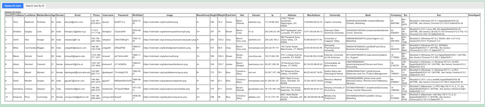
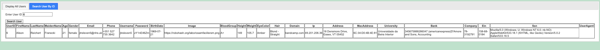

# Java-practice
Exercises and tech tests while learning Java,jQuery with Ajax, and Spring Boot as a trainee at Wiley Edge.

## Tech Tests:
- Flooring Order - Group Project (Maven, Spring with Java Configuration)
- Vending Machine with Java Config class
- Vending Machine Java Projects
- DVD Library
- Date & Time
- Game Rock, Paper, Scissors
- Print Factorial

## jQuery with Ajax:
- Users Ajax API request with two tabs

##### Output of tab 1 - Display All Users

##### Output of tab 2 - Search User By ID number 6

## Java Advanced Maven:
Maven lifecycle, and Spring for dependency injection.

## Java Intermediate:
Enums, Lambdas and Streams, Service Layer, Unit Testing and JUnit, DateTime API, and BigDecimal.

## Java Classes:
Classes and Objects, Public Interface / Private Implementation, Encapsulation and Data Hiding, Properties, Accessors (getters) and Mutators (setters), Methods, Constructors, Object Instantiation and Method Invocation, Static, Memory Management (Stack, Heap and Garbage Collection), Interfaces and Polymorphism, Composition, Inheritance, Collection and Maps, Javadoc, File I/O, Exceptions, Software Development Lifecycle (SDLC), Agile Development, Tiered Application Design Concepts for CRUD Applications, Packages, Data Marshaling and Unmarshaling.

## Java Basics:
Java Lifecycle, Operators, Variables, Data Types, TypeConversion, Pre and Post increment, Boolean Expressions, Relational and Conditional Operators, If and Switch Statements, Collecting Console Input (Scanner and Parsing), Loops, Flowcharts, Arrays, Types of Arrays, Debugging, and Random numbers.

