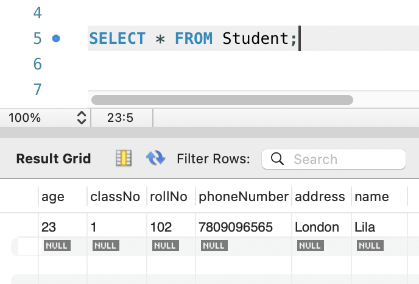

# Java-practice
Exercises and tech tests while learning Java, jQuery with Ajax, and Spring Boot as a trainee at Wiley Edge.

## Tech Tests:
- Date & Time
- DVD Library
- Flooring Order - Group Project (Maven, Spring with Java Configuration)
- Game Rock, Paper, Scissors
- Guess the Number - Group Project (with @GetMapping, @PutMapping, and @PostMapping)
- Print Factorial
- Vending Machine Java Projects
- Vending Machine with Java Config class

## Java Web App JPA:
### Students Spring Boot JPA
- Creating a new student and getting a student by their class number (via console menu):

 

- Confirmation that the new student has been created (MySQLWorkbench):



### One-to-many Person-Vehicle JPA
- Using Hibernate/JPAData I added the seeds to tables Person and Vehicle, and created an association OneToMany (one person has many vehicles):


## Java Web App: 
### Dvd REST API
- Get a DVD by its ID number (request: http://localhost:8082/dvds/5)
```json
{"dvdID":5,"title":"Beetlejuice","mpaaRating":6,"directorName":"Tim_Burton","studio":"Warner","userRating":7}
```
  
- Get all DVDs from the database (request: http://localhost:8082/dvds)
```json
{"dvds":[{"dvdID":5,"title":"Beetlejuice","mpaaRating":6,"directorName":"Tim_Burton","studio":"Warner","userRating":7},{"dvdID":11,"title":"The Shawshank Redemption","mpaaRating":4,"directorName":"Frank Darabont","studio":"Columbia Pictures","userRating":9},{"dvdID":12,"title":"The Godfather","mpaaRating":5,"directorName":"Francis Ford Coppola","studio":"Paramount Pictures","userRating":9},{"dvdID":13,"title":"Pulp Fiction","mpaaRating":4,"directorName":"Quentin Tarantino","studio":"Miramax Films","userRating":8},{"dvdID":14,"title":"The Dark Knight","mpaaRating":5,"directorName":"Christopher Nolan","studio":"Warner Bros.","userRating":9},{"dvdID":15,"title":"Fight Club","mpaaRating":5,"directorName":"David Fincher","studio":"20th Century Fox","userRating":8},{"dvdID":16,"title":"Inception","mpaaRating":4,"directorName":"Christopher Nolan","studio":"Warner Bros.","userRating":9},{"dvdID":17,"title":"The Matrix","mpaaRating":4,"directorName":"Lana Wachowski","studio":"Warner Bros.","userRating":8},{"dvdID":18,"title":"The Lord of the Rings One","mpaaRating":4,"directorName":"Peter Jackson","studio":"New Line Cinema","userRating":9},{"dvdID":19,"title":"Forrest Gump","mpaaRating":4,"directorName":"Robert Zemeckis","studio":"Paramount Pictures","userRating":9},{"dvdID":20,"title":"The Avengers","mpaaRating":3,"directorName":"Joss Whedon","studio":"Marvel Studios","userRating":8}]}
```

### Spring Boot JDBC
- SpringBootDvdJDBCProperties: with the `application.properties` file

### Spring JDBC (Java Database Connectivity)
- DvdJDBCPSpringJavaConfig: with Java Configuration
- DvdJDBCPSpringJavaConfigtoTemplateWithRowMapper: with Row Mapper (converted from Java Configuration)

### jQuery and jQuery with Ajax:
- jQuery (query integration to the HTML file tag <script></script>)
- jQuery with Ajax API request (fake API used: https://dummyjson.com/)

##### Output of tab 1 - Display All Users


##### Output of tab 2 - Search User By ID number 6


## Java Advanced Maven:
Maven lifecycle, and Spring for dependency injection.

## Java Intermediate:
Enums, Lambdas and Streams, Service Layer, Unit Testing and JUnit, DateTime API, and BigDecimal.

## Java Classes:
Classes and Objects, Public Interface / Private Implementation, Encapsulation and Data Hiding, Properties, Accessors (getters) and Mutators (setters), Methods, Constructors, Object Instantiation and Method Invocation, Static, Memory Management (Stack, Heap and Garbage Collection), Interfaces and Polymorphism, Composition, Inheritance, Collection and Maps, Javadoc, File I/O, Exceptions, Software Development Lifecycle (SDLC), Agile Development, Tiered Application Design Concepts for CRUD Applications, Packages, Data Marshaling and Unmarshaling.

## Java Basics:
Java Lifecycle, Operators, Variables, Data Types, TypeConversion, Pre and Post increment, Boolean Expressions, Relational and Conditional Operators, If and Switch Statements, Collecting Console Input (Scanner and Parsing), Loops, Flowcharts, Arrays, Types of Arrays, Debugging, and Random numbers.

