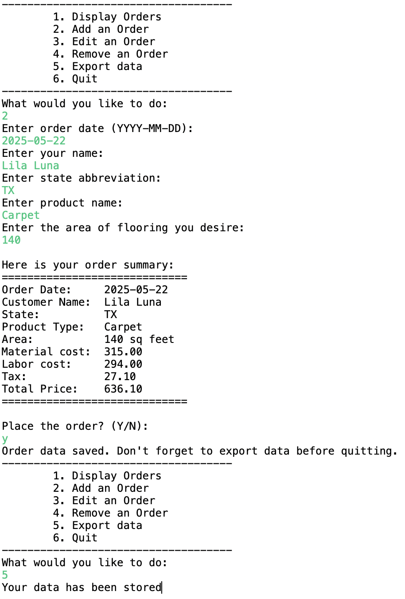

# di004_mandatory_code-project_floor_mastery-team-4
di004_mandatory_code-project_floor_mastery-team-4 created by GitHub Classroom

The goal of this mastery project is to create an application that can read and write flooring orders for Wiley Edge Corp.

## Unit testing
Unit Testing (100% of DAO tests passing; 80% of Service Layer tests passing);

## Demonstration of menu options 2 (Add an Order) and 5 (Export data)

